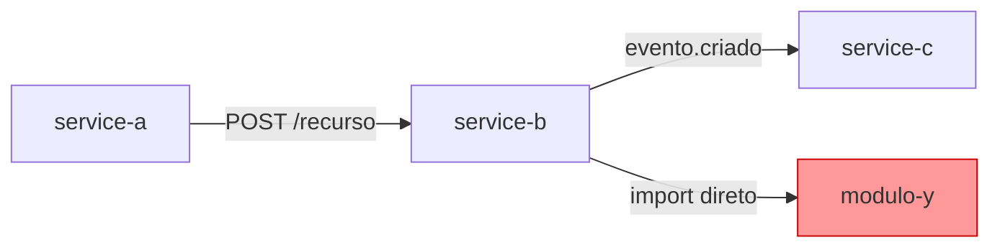

# Skill: Mapeamento de Grafo de Dependências

> Rastreamento estruturado de dependências entre sistemas, módulos e serviços para análise de acoplamento, blast radius e fluxo de dados.

## Quando Usar

- Antes de refatorar módulo ou serviço com dependentes desconhecidos.
- Para calcular blast radius de uma mudança (quantos sistemas podem ser afetados).
- Para detectar acoplamento excessivo e sugerir estratégia de desacoplamento.
- Para rastrear origem → transformação → destino de um dado sensível.
- Para identificar dependências circulares entre módulos do mesmo sistema.
- Para gerar diagrama de arquitetura baseado em código real (não em desenho manual).

## Taxonomia de Acoplamento

| Tipo | Definição | Risco | Exemplo |
|---|---|---|---|
| **Tight (forte)** | Mudança no provedor quebra consumer diretamente | Alto | Consumer importa classe concreta do provedor |
| **Loose (fraco)** | Comunicação via contrato/interface/evento | Médio | Consumer usa interface ou cliente HTTP gerado |
| **Eventual** | Comunicação assíncrona via fila/evento | Baixo | Consumer subscreve evento, não depende de uptime |
| **Circular** | A depende de B que depende de A | Crítico | Dependência mútua entre módulos |

## Protocolo de Coleta (4 Etapas)

**Etapa 1 — Identificar pontos de entrada**

```bash
# Imports diretos entre módulos
grep -r "from.*<modulo-alvo>" --include="*.ts" --include="*.js" -l
grep -r "import.*<modulo-alvo>" --include="*.java" --include="*.py" -l

# HTTP clients apontando para serviço
grep -r "http.*<nome-servico>" --include="*.ts" --include="*.yaml" -l
grep -r "baseUrl.*<nome-servico>" --include="*.ts" --include="*.json" -l

# Referências a tópicos de fila/evento
grep -r "<nome-topico>" --include="*.ts" --include="*.java" --include="*.yaml" -l
```

**Etapa 2 — Construir grafo (tabela)**

| Origem | Tipo de Dep. | Destino | Contrato | Acoplamento |
|---|---|---|---|---|
| `service-a` | HTTP REST | `service-b` | `POST /api/v1/recurso` | Loose |
| `service-b` | Evento/Fila | `service-c` | `topico.evento.criado` | Eventual |
| `modulo-x` | Import direto | `modulo-y` | `ClasseConcreta` | Tight |

**Etapa 3 — Calcular blast radius**

Para cada nó do grafo:
- **Profundidade 1:** dependentes diretos (impactados imediatamente).
- **Profundidade 2:** dependentes dos dependentes (impactados indiretamente).
- **Crítico:** qualquer dependência circular → risco de cascata.

**Etapa 4 — Classificar risco**

| Critério | Classificação |
|---|---|
| 0 dependentes diretos | Baixo risco |
| 1-3 dependentes diretos | Médio risco |
| 4+ dependentes diretos ou circular | Alto risco |
| Dependência de dado sensível (PII, financeiro) | Alto risco independente do count |

## Rastreamento de Fluxo de Dados

Protocolo: **Origem → Transformação → Destino**

```markdown
### Fluxo: <nome-do-fluxo>

1. **Origem:** `<sistema/módulo>` — `<endpoint ou evento que produz o dado>`
2. **Transformação:**
   - `<serviço/módulo>`: <o que transforma e como>
   - `<serviço/módulo>`: <próxima transformação>
3. **Destino:** `<sistema/módulo>` — `<onde o dado é persistido ou consumido>`

**Dado rastreado:** <campo, schema ou payload>
**Acoplamento:** Tight | Loose | Eventual
**Sensibilidade:** PII | Financeiro | Público
```

## Geração de Diagrama Mermaid

Após construir o grafo, gerar diagrama com skill `mermaid-diagrams`:



> Convenção de cores:
> - `#ff9999` (vermelho): acoplamento tight — risco alto
> - `#ffcc88` (laranja): acoplamento loose — risco médio
> - `#99ff99` (verde): acoplamento eventual — risco baixo
> - `#ccccff` (azul): dependência circular — risco crítico

## Checklist

- [ ] Todas as dependências de importação direta mapeadas.
- [ ] Todos os HTTP clients identificados (URLs hardcoded, configs de proxy, service discovery).
- [ ] Tópicos de fila/evento rastreados (producer → consumer).
- [ ] Dependências circulares verificadas.
- [ ] Blast radius calculado (profundidade 1 e 2).
- [ ] Acoplamento classificado por link do grafo.
- [ ] Diagrama Mermaid gerado para dependências com 3+ nós.
- [ ] Dados sensíveis rastreados separadamente.

## Saída Esperada

```markdown
### Grafo de Dependências — <módulo/serviço alvo>

**Blast radius:** <N sistemas diretamente afetados>, <M indiretamente>
**Dependências circulares:** Sim | Não
**Acoplamento predominante:** Tight | Loose | Eventual

#### Tabela de Dependências

| Origem | → | Destino | Tipo | Acoplamento | Risco |
|---|---|---|---|---|---|
| ... | | ... | ... | ... | ... |

#### Diagrama

[mermaid flowchart]

**Recomendação:** <desacoplamento via interface / versionamento / nenhuma ação>
```

## Anti-padrões

- Mapear apenas dependências de código sem verificar HTTP clients e tópicos de fila.
- Ignorar profundidade 2 (dependentes indiretos) no cálculo de blast radius.
- Gerar diagrama antes de ter a tabela de grafo validada.
- Não classificar acoplamento — tight e eventual têm estratégias de migração distintas.

## Referências

- Dependency Inversion Principle (SOLID): https://en.wikipedia.org/wiki/Dependency_inversion_principle
- Event-Driven Architecture Patterns: https://microservices.io/patterns/data/event-driven-architecture.html
- Cross-Repository Dependency Analysis: https://ijecs.in/index.php/ijecs/article/view/5599

