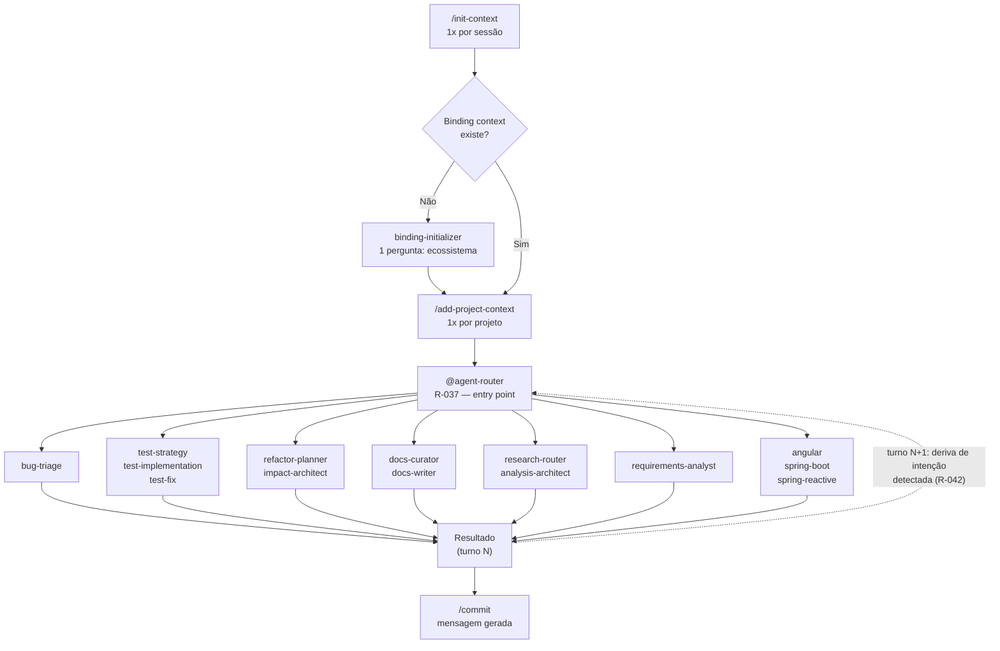

# Deep Agents Copilot — Estrutura de Governança Genérica e Reutilizável

## Propósito

Este repositório estabelece uma **base de governança genérica e reutilizável** para uso de IA (Copilot, Claude, ChatGPT) em projetos técnicos.

Objetivo:
- ✅ Governança **desacoplada** de domínio e tecnologia específica
- ✅ Padrões operacionais **reutilizáveis** em qualquer ecossistema
- ✅ Separação clara entre regras globais e customizações por stack/projeto
- ✅ Binding hierárquico com carregamento automático de adapters

---

## Estrutura

### Nível 1: Governança Global (Genérica)

**Fonte de Verdade Operacional:**

- **[`CLAUDE.md`](CLAUDE.md)** — Regras normativas (R-001..R-042), princípios e fluxos genéricos
- **[`.github/copilot-instructions.md`](.github/copilot-instructions.md)** — Execução operacional e roteamento de agents

**Características:**
- Sem referência a projetos específicos
- Sem específicos de linguagem ou framework
- Aplicável a qualquer ecossistema

### Nível 2: Adapters (Stack/Domínio Específico)

**Local:** `.github/instructions/`

Exemplos:
- `spring-boot-backend.instructions.md` — Padrões exclusivos para Java/Spring Backend
- `angular-v21-frontend.instructions.md` — Padrões exclusivos para Angular Frontend

**Características:**
- Referências específicas de projeto/tecnologia **permitidas e esperadas**
- Nunca incluem regras globais (apenas referências)
- Declarados em `docs/ai-context/catalog.yaml` com `applyTo` glob patterns

### Nível 3: Contexto de Binding e Artefatos de Governança

**Local:** `docs/ai-context/`

- **`catalog.yaml`** — Manifest único de adapters, projetos e mapping stack → instrução; inclui seção `governance_artefacts` com artefatos estruturais de IA
- **`binding.md`** — Documentação de binding e descoberta
- **`routing-graph.yaml`** — ⭐ **Grafo de roteamento declarado** (nós = agents, arestas = condições, política de cascata) — fonte de verdade estrutural do `agent-router` (R-040)
- **`evals/casos-roteamento.yaml`** — Suíte de casos de teste de regressão de roteamento (canônicos, ambíguos, regressão, segurança)

---

## Princípios Fundamentais

### 1. **Genericidade Obrigatória (R-038)**

Todo arquivo criado em `.github/` (agents, skills, prompts, copilot-instructions) **DEVE ser genérico**:

```
❌ PROIBIDO em .github/:
- "Use Spring Boot para..."
- "Em Angular, configure..."
- "Integração com [Jira-específica]"

✅ PERMITIDO em .github/instructions/adapters:
- "No backend Java/Spring..."
- "Para projetos Angular..."
- "Adapters registrados em catalog.yaml"
```

**Teste rápido:** Substitua mentalmente `[PROJETO]` e `[TECH]` — o texto continua válido?

### 2. **Sem Duplicação (R-003)**

- Regras globais **vivem apenas em `CLAUDE.md`**
- `.github/copilot-instructions.md` **referencia**, não copia
- Adapters **referem-se a `CLAUDE.md`** para governança global

### 3. **Hierarquia em Caso de Conflito**

```
System Instructions
     ↓
Developer Instructions (este repositório)
     ↓
User Request
     ↓
Arquivos Locais (CLAUDE.md → copilot-instructions.md → adapters)
```

---

## Como Usar

### Para Desenvolvedores de IA (Copilot, Cursor, Claude Code)

1. Carregue **`CLAUDE.md`** como fonte de verdade global
2. Carregue **`.github/copilot-instructions.md`** para roteamento operacional
3. Identifique o projeto/stack alvo
4. Carregue o adapter correspondente via `docs/ai-context/catalog.yaml`

**Fluxo operacional:**



### Para Adicionar Novo Adapter

1. **Criar** `.github/instructions/<nome>.instructions.md`
   ```yaml
   ---
   applyTo: ["src/**/*.ext"]  # Glob patterns
   ---
   # Conteúdo específico do stack/domínio
   ```

2. **Registrar** em `docs/ai-context/catalog.yaml`:
   ```yaml
   adapters:
     - name: seu-adapter
       applies_to: ["src/**/*.ext"]
       description: "Descrição breve"
   ```

3. **Documentação** via `docs/ai-context/binding.md`

---

## Regras de Ouro

| Regra | Aplica-se em | Razão |
|-------|------------|-------|
| **R-037: Agent Router First** | Toda solicitação | Triagem + governança |
| **R-042: Re-triagem por Turno (Anti Sticky-Session)** | Toda solicitação subsequente ao 1º turno | Evita agent downstream continuar sozinho após deriva de intenção |
| **R-040: Grafo de Roteamento** | Toda nova rota de agent | Dado estruturado > prosa; rastreabilidade + evals |
| **R-036: Model Enforcement** | Agents/Skills/Prompts | QoS e segurança |
| **R-034: Health Check Binding** | Novo repositório | Descoberta de adapters |
| **R-038: Genericidade Obrigatória** | Tudo em `.github/` | Reutilização |
| **R-031: Plano Auto-Implementável** | Implementação | Zero-interrupção após aprovação |
| **R-033: Sem Docs Automáticas** | Governança | Aprovação explícita antes de criar `.md` |

---

## Referências Rápidas

- **Governança Global:** [`CLAUDE.md`](CLAUDE.md)
- **Operacional:** [`.github/copilot-instructions.md`](.github/copilot-instructions.md)
- **Catalog de Adapters + Artefatos:** [`docs/ai-context/catalog.yaml`](docs/ai-context/catalog.yaml)
- **Grafo de Roteamento (R-040):** [`docs/ai-context/routing-graph.yaml`](docs/ai-context/routing-graph.yaml)
- **Suíte de Evals:** [`docs/ai-context/evals/casos-roteamento.yaml`](docs/ai-context/evals/casos-roteamento.yaml)
- **Plano de Melhorias Implementado:** [`docs/plan/plano-implementacao-orquestracao.md`](docs/plan/plano-implementacao-orquestracao.md)
- **Agents Disponíveis:** `.github/agents/README.md`
- **Skills Disponíveis:** `.github/skills/README.md`
- **Adapters Registrados:** `.github/instructions/README.md`

---

## Status Atual (2026-08-30)

### Governança Global
- ✅ Regras normativas consolidadas (`CLAUDE.md` — R-001..R-042)
- ✅ Roteamento operacional (`copilot-instructions.md`)
- ✅ Genericidade explícita em todas as regras globais (R-038)
- ✅ Re-triagem obrigatória por turno (R-042 — anti sticky-session), fechando o gap de agent downstream que perdia a inteligência de roteamento após o 1º turno

### Adapters de Stack
- ✅ `spring-boot-backend.instructions.md` — Java/Spring Boot
- ✅ `angular-v21-frontend.instructions.md` — Angular 21
- ✅ `python-backend.instructions.md` — Python
- ✅ `database.instructions.md` — Banco de dados / Migrações
- ✅ `devops.instructions.md` — Docker, Kubernetes, CI/CD

### Agents (24 catalogados)
- ✅ `agent-router` v1.5.0 — PASSO 0.3 de re-triagem por deriva de intenção (R-042), output com campo `Agente Ativo`, roteamento direto para `angular`/`spring-boot`/`spring-reactive` (antes órfãos no grafo)
- ✅ `prompt-structuring` — passo mandatório pós-Health Check (R-041), loop de auto-refinamento (máx. 5 iterações)
- ✅ 22 agents downstream especializados, agrupados por função:
  - **Triagem/Qualidade:** `bug-triage`, `test-strategy`, `test-implementation`, `test-fix`
  - **Planejamento/Impacto/Requisitos:** `requirements-analyst`, `refactor-planner`, `impact-architect`, `business-rules-extractor`
  - **Documentação:** `docs-curator` (curadoria de doc existente), `docs-writer` (escrita de doc nova em `.md`, perfil documentador)
  - **Pesquisa/Análise:** `research-router`, `analysis-architect` (unificado com integrações cross-sistema OpenAPI/AsyncAPI/gRPC/GraphQL)
  - **Especialistas de Recomendação e Implementação (enterprise, perfil híbrido v2.0.0):** `angular`, `spring-boot`, `spring-reactive`
  - **Governança de Agents/Skills/Prompts:** `agent-factory`, `skill-factory`, `prompt-factory`
  - **Contexto/Binding:** `context-builder`, `binding-initializer`, `adapter-generator`

### Skills (45 indexadas)
- ✅ Tier 1 (Core): `context-mode`, `agent-contracts`, `handoff-governance`, `confidence-fallback-policy`, `agent-safety-guardrails`, `terminal-governance`, `code-tracing`, `business-rules-governance`, `java-jdk-backend-governance`
- ✅ Tier 2 (Support): 29 skills cobrindo testing (backend/frontend/Spring Boot/Angular/Python), observability, quality, tooling, research, frontend patterns, backend patterns, **documentation** (`documentation-writing-patterns` — base do `docs-writer`) e **engenharia de requisitos** (`requirements-engineering-patterns` — base do `requirements-analyst`)
- ✅ Tier 3 (Experimental): `agent-memory-policy` — memória episódica/semântica/procedimental

### Artefatos Estruturais de Orquestração (novo — 2026-08-28/29/30)
- ✅ `docs/ai-context/routing-graph.yaml` — grafo de roteamento declarado (R-040): nós, arestas, condições e política de cascata rule-based→semantic→LLM; inclui rotas dedicadas para `docs-writer`, `code-review`, `requirements-analyst` e os 3 specialists (`angular`/`spring-boot`/`spring-reactive`); aresta reversa universal `*downstream → agent-router` (R-042)
- ✅ `docs/ai-context/evals/casos-roteamento.yaml` — suíte de 40 casos de teste (17 canônicos, 4 ambíguos, 15 regressão, 4 segurança) — inclui casos de não-confusão e 2 casos de regressão de sticky-session multi-turno
- ✅ `docs/ai-context/catalog.yaml` v1.2 — seção `governance_artefacts` com os novos artefatos

### Anti Sticky-Session (novo — 2026-08-30)
- ✅ **R-042** — todo agent downstream/specialist declara seção "Retorno ao Router" com gatilho objetivo de deriva de intenção (mudança de verbo de ação, stack fora de competência, pedido de execução em agent read-only)
- ✅ Fecha 2 gaps reportados: (1) agent downstream perdia inteligência de roteamento após o 1º turno; (2) especialistas `angular`/`spring-boot`/`spring-reactive` eram órfãos no grafo — só alcançáveis por `@menção` manual, nunca roteados automaticamente pelo `agent-router`
- ✅ Pesquisa de mercado: OpenAI Agents SDK (`handoff()`/`transfer_back_to_*`), LangGraph `langgraph-supervisor` (`add_handoff_back_messages`), state machine de 2 modos com detecção conservadora de deriva de tópico

### Especialistas Híbridos — Advisory + Implementação (novo — 2026-08-30)
- ✅ `angular`/`spring-boot`/`spring-reactive` v2.0.0 — deixam de ser "advisory puro" e passam a implementar feature/bugfix dentro do próprio domínio de stack, com testing-first obrigatório e diff mínimo
- ✅ 3 skills novas de implementação consolidadas via pesquisa de mercado 2026 (Tavily): `angular-implementation-patterns`, `spring-boot-implementation-patterns`, `spring-reactive-implementation-patterns` — complementares às 3 skills de análise já existentes
- ✅ R-042 ajustado: implementar **dentro** do domínio do specialist não é mais deriva de intenção; deriva só ocorre em pivô cross-stack (ex.: `@angular` recebe pedido Spring Boot)

### Skills de Orquestração Evoluídas (2026-08-28)
- ✅ `handoff-governance` — schema formal tipado v1.0 + guardrails gap + fan-out/fan-in + agent identity
- ✅ `agent-contracts` — limites de delegação (`max_delegation_depth`, `max_execution_time`) + context engineering (XML canônico, prompt caching, context budget)
- ✅ `context-mode` — 6 dimensões de memória short-term vs long-term formalizadas
- ✅ `confidence-fallback-policy` — routing em cascata (rule→semantic→LLM) + ambiguity zone + logging estruturado
- ✅ `agent-evals-lab` — seção 9 com link para arquivo real de casos (suíte deixou de ser aspiracional)

### Perfil Documentador (novo — 2026-08-29)
- ✅ `docs-writer` (agent) — perfil documentador agnóstico de domínio; gera/atualiza documentação técnica em Markdown (Diátaxis, ADR/MADR, README, runbook, postmortem); produz **exclusivamente** arquivos `.md`; nunca alucina comportamento não verificado no código-fonte
- ✅ `documentation-writing-patterns` (skill, Tier 2) — base de conhecimento consolidada via pesquisa de mercado (Diátaxis, Google/Microsoft Style Guide, MADR, standard-readme, `llms.txt`, práticas anti-alucinação Anthropic/Copilot/Cursor)
- ✅ Diferença de escopo: `docs-writer` **escreve documentação nova**; `docs-curator` **cura/padroniza documentação de governança já existente** — roteamento distinguido em `routing-graph.yaml` e validado em `casos-roteamento.yaml` (`regr-008`, `regr-009`)

### Perfil de Requisitos (novo — 2026-08-29)
- ✅ `requirements-analyst` (agent) — perfil de elicitação prospectiva; transforma pedido ambíguo em requisitos funcionais/não-funcionais estruturados e testáveis, com rastreabilidade à fonte do stakeholder
- ✅ `requirements-engineering-patterns` (skill, Tier 2) — base de conhecimento consolidada via pesquisa de mercado (ISO/IEC/IEEE 29148, EARS, INVEST, Gherkin/BDD, FURPS+, anti-solution-jumping com Five Whys)
- ✅ Diferença de escopo: `requirements-analyst` **pedido de negócio → requisito novo**; `business-rules-extractor` **código existente → regra documentada** — distinção roteada e validada nos casos `regr-012` e `regr-013`

---

## Contribuindo

1. **Alteração em regra global?** → Edite `CLAUDE.md`, sincronize copilot-instructions.md
2. **Novo adapter?** → Crie em `.github/instructions/`, registre em `catalog.yaml`
3. **Nova documentação?** → Use `kebab-case`, valide genericidade (R-038)
4. **Sem docs autônomas** → Solicite aprovação antes de criar `.md` (R-033)

---

**Governança reutilizável. Multi-projeto. Zero-dependência.**

