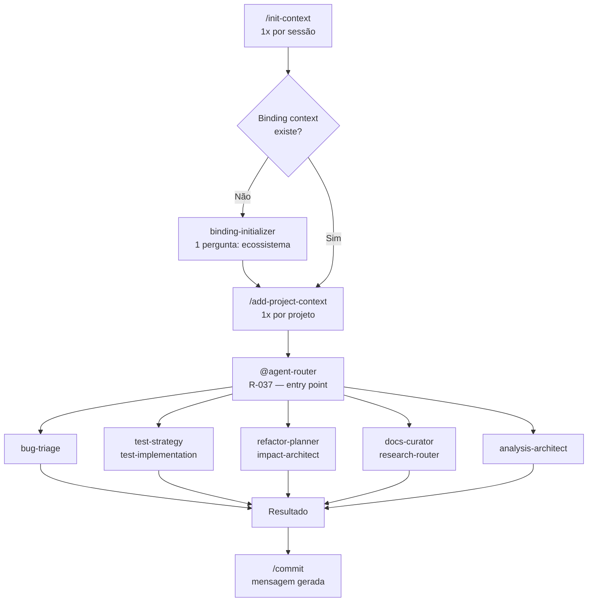

# Eco-Sistema Copilot — Estrutura de Governança de IA Reutilizável

## Propósito

Este repositório estabelece uma **base de governança genérica e reutilizável** para uso de IA (Copilot, Claude, ChatGPT) em projetos técnicos.

Objetivo:
- ✅ Governança **desacoplada** de domínio e tecnologia específica
- ✅ Padrões operacionais **reutilizáveis** em qualquer ecossistema
- ✅ Separação clara entre regras globais e customizações por stack/projeto
- ✅ Binding hierárquico com carregamento automático de adapters

---

## Estrutura

### Nível 1: Governança Global (Genérica)

**Fonte de Verdade Operacional:**

- **[`CLAUDE.md`](CLAUDE.md)** — Regras normativas (R-001..R-036), princípios e fluxos genéricos
- **[`.github/copilot-instructions.md`](.github/copilot-instructions.md)** — Execução operacional e roteamento de agents

**Características:**
- Sem referência a projetos específicos
- Sem específicos de linguagem ou framework
- Aplicável a qualquer ecossistema

### Nível 2: Adapters (Stack/Domínio Específico)

**Local:** `.github/instructions/`

Exemplos:
- `spring-boot-backend.instructions.md` — Padrões exclusivos para Java/Spring Backend
- `angular-v21-frontend.instructions.md` — Padrões exclusivos para Angular Frontend

**Características:**
- Referências específicas de projeto/tecnologia **permitidas e esperadas**
- Nunca incluem regras globais (apenas referências)
- Declarados em `docs/ai-context/catalog.yaml` com `applyTo` glob patterns

### Nível 3: Contexto de Binding

**Local:** `docs/ai-context/`

- **`catalog.yaml`** — Manifest único de carregamento de adapters, projetos e mapping stack → instrução
- **`binding.md`** — Documentação de binding e descoberta

---

## Princípios Fundamentais

### 1. **Genericidade Obrigatória (R-038)**

Todo arquivo criado em `.github/` (agents, skills, prompts, copilot-instructions) **DEVE ser genérico**:

```
❌ PROIBIDO em .github/:
- "Use Spring Boot para..."
- "Em Angular, configure..."
- "Integração com [Jira-específica]"

✅ PERMITIDO em .github/instructions/adapters:
- "No backend Java/Spring..."
- "Para projetos Angular..."
- "Adapters registrados em catalog.yaml"
```

**Teste rápido:** Substitua mentalmente `[PROJETO]` e `[TECH]` — o texto continua válido?

### 2. **Sem Duplicação (R-003)**

- Regras globais **vivem apenas em `CLAUDE.md`**
- `.github/copilot-instructions.md` **referencia**, não copia
- Adapters **referem-se a `CLAUDE.md`** para governança global

### 3. **Hierarquia em Caso de Conflito**

```
System Instructions
     ↓
Developer Instructions (este repositório)
     ↓
User Request
     ↓
Arquivos Locais (CLAUDE.md → copilot-instructions.md → adapters)
```

---

## Como Usar

### Para Desenvolvedores de IA (Copilot, Cursor, Claude Code)

1. Carregue **`CLAUDE.md`** como fonte de verdade global
2. Carregue **`.github/copilot-instructions.md`** para roteamento operacional
3. Identifique o projeto/stack alvo
4. Carregue o adapter correspondente via `docs/ai-context/catalog.yaml`

**Fluxo operacional:**



### Para Adicionar Novo Adapter

1. **Criar** `.github/instructions/<nome>.instructions.md`
   ```yaml
   ---
   applyTo: ["src/**/*.ext"]  # Glob patterns
   ---
   # Conteúdo específico do stack/domínio
   ```

2. **Registrar** em `docs/ai-context/catalog.yaml`:
   ```yaml
   adapters:
     - name: seu-adapter
       applies_to: ["src/**/*.ext"]
       description: "Descrição breve"
   ```

3. **Documentação** via `docs/ai-context/binding.md`

---

## Regras de Ouro

| Regra | Aplica-se em | Razão |
|-------|------------|-------|
| **R-037: Agent Router First** | Toda solicitação | Triagem + governança |
| **R-036: Model Enforcement** | Agents/Skills/Prompts | QoS e segurança |
| **R-034: Health Check Binding** | Novo repositório | Descoberta de adapters |
| **R-038: Genericidade Obrigatória** | Tudo em `.github/` | Reutilização |
| **R-031: Plano Auto-Implementável** | Implementação | Zero-interrupção após aprovação |
| **R-033: Sem Docs Automáticas** | Governança | Aprovação explícita antes de criar `.md` |

---

## Referências Rápidas

- **Governança Global:** [`CLAUDE.md`](CLAUDE.md)
- **Operacional:** [`.github/copilot-instructions.md`](.github/copilot-instructions.md)
- **Catalog de Adapters:** [`docs/ai-context/catalog.yaml`](docs/ai-context/catalog.yaml)
- **Agents Disponíveis:** `.github/agents/README.md`
- **Skills Disponíveis:** `.github/skills/README.md`
- **Adapters Registrados:** `.github/instructions/README.md`

---

## Status Atual (2026-06-12)

- ✅ Governança global consolidada (CLAUDE.md — R-001..R-039)
- ✅ Roteamento operacional (copilot-instructions.md)
- ✅ Adapters base (spring-boot-backend.instructions.md, angular-v21-frontend.instructions.md)
- ✅ Binding hierárquico instanciado (docs/ai-context/catalog.yaml + binding.md)
- ✅ Genericidade explícita em todas as regras globais (R-038)
- ✅ 15 agents catalogados (incluindo skill-factory)
- ✅ 20 skills indexadas (incluindo git-governance)
- ✅ Prompts: /commit, /review, /health adicionados
- ✅ catalog.yaml e .index.json sincronizados

---

## Contribuindo

1. **Alteração em regra global?** → Edite `CLAUDE.md`, sincronize copilot-instructions.md
2. **Novo adapter?** → Crie em `.github/instructions/`, registre em `catalog.yaml`
3. **Nova documentação?** → Use `kebab-case`, valide genericidade (R-038)
4. **Sem docs autônomas** → Solicite aprovação antes de criar `.md` (R-033)

---

**Governança reutilizável. Multi-projeto. Zero-dependência.**

