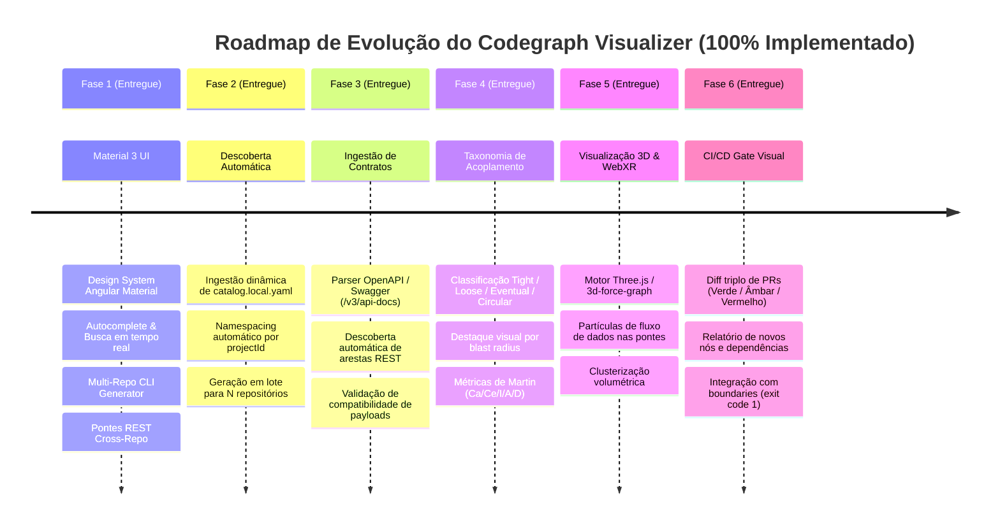

# Roadmap Técnico — Codegraph Visualizer

> Documento de planejamento e evolução técnica do visualizador de grafos de conhecimento multi-repositório.
> Define fases, entregáveis, arquitetura e critérios de aceitação para expansão contínua.

---

## 📌 Visão Geral do Produto

O **Codegraph Visualizer** é uma ferramenta desacoplada para exploração visual, auditoria e navegação de dependências estruturais de código-fonte (AST) e pontes de integração cross-repo (REST, SOAP, Filas, RPC) entre múltiplos serviços de um ecossistema.

---

## 🗺️ Fases de Evolução

---

## 📋 Detalhamento das Fases

### Fase 1: Material 3 UI & CLI Multi-Repo (✅ Concluída)
- [x] Template standalone HTML com Angular Material 3 (`Roboto`, `Material Symbols Outlined`).
- [x] Agregação de múltiplos bancos `.codegraph/graph.db` (SQLite via Tree-sitter).
- [x] Autocomplete de busca com zoom animado e realce de nós.
- [x] Chips de filtro rápido por repositório com contagem em tempo real.
- [x] Side Sheet Inspector com detalhes de fan-in/fan-out e chamadores/chamados.
- [x] Renderização de pontes REST cross-repo em destaque (`━━━►`).
- [x] Contrato de schema padronizado em `schemas/graph.schema.json`.

---

### Fase 2: Descoberta Automática via Catálogo de Projetos (✅ Concluída)
- [x] Leitura automática de `docs/ai-context/catalog.yaml` e `docs/ai-context/catalog.local.yaml` (merge em memória, conforme R-043).
- [x] Suporte a flags `--db`, `--projects` e `--catalog` para geração flexível de N repositórios.
- [x] Atribuição dinâmica de paletas de cores e metadados por projeto.
- [x] Namespacing automático de IDs de nós para prevenir colisões (`<project_id>_<node_id>`).

---

### Fase 3: Ingestão de Contratos de API (OpenAPI / Swagger / AsyncAPI) (✅ Concluída)
- [x] Leitor de especificações OpenAPI 3.0/3.1 (`/v3/api-docs` ou `swagger.json`) e AsyncAPI via `contract_parser.py`.
- [x] Correlacionador automático de rotas: `Angular HttpClient` / `RestTemplate` ➔ `Spring @RestController`.
- [x] Classificação de compatibilidade de contrato: `COMPATIBLE` (verde) | `BREAKING` (vermelho) | `UNVERIFIED` (amarelo).
- [x] Suporte básico a canais e tópicos de mensageria AsyncAPI (RabbitMQ/Kafka).

---

### Fase 4: Taxonomia e Métricas de Acoplamento de Robert Martin (✅ Concluída)
- [x] Módulo `metrics_calculator.py` com cálculo determinístico de métricas de arquitetura limpa:
  - **Afferent Coupling ($Ca$)**: Chamadores externos ao pacote.
  - **Efferent Coupling ($Ce$)**: Dependências externas do pacote.
  - **Instability Index ($I = \frac{Ce}{Ca+Ce}$)**: Indicador de estabilidade ($0.0$ estável a $1.0$ flexível).
  - **Abstractness ($A$)**: Relação de interfaces/abstrações sobre total de classes.
  - **Distance ($D = |A + I - 1|$)**: Balanço arquitetural e classificação de zonas (*Zona de Dor*, *Sequência Principal*, *Zona de Inutilidade*).
- [x] Algoritmo determinístico de detecção de ciclos circulares (Tarjan SCC) com botão de isolamento no canvas.
- [x] Painel / Modal Material 3 com tabela ordenada de métricas por módulo e busca em tempo real.

---

### Fase 5: Renderização 3D e Navegação Espacial (WebXR) (✅ Concluída)
- [x] Alternador de modo de renderização: `2D (vis-network)` ⇄ `3D (3d-force-graph / Three.js WebGL)`.
- [x] Animação de fluxo de dados nas pontes REST cross-repo (`linkDirectionalParticles`).
- [x] Otimização por WebGL para 60 FPS com dezenas de milhares de nós.

---

### Fase 6: CI/CD Gate Visual & Revisão de PR (✅ Concluída)
- [x] Geração de snapshot visual do diff Git triplo (`diff_checker.py`):
  - 🟢 **Verde (`#10B981`)**: Nós adicionados no diff.
  - 🟡 **Âmbar (`#F59E0B`)**: Nós modificados no diff.
  - 🔴 **Vermelho (`#EF4444`)**: Nós ou arestas removidos.
- [x] Modo CI Gate (`--ci` / `--check-boundaries`): validação automática de regras do `manifesto.boundaries` em `.codegraphrc.json`, retornando `exit code 1` em caso de violação com relatório detalhado.

---

## 🛡️ Diretrizes de Governança e Manutenção

- **Genericidade (R-038)**: Todos os scripts em `generator/` e templates em `template/` devem permanecer agnósticos de tecnologia e sem referências proprietárias.
- **Isolamento de Dados Locais (R-043)**: Arquivos `.html` gerados e bancos SQLite locais nunca são commitados no repositório compartilhado — vivem na pasta `exports/` (gitignored).
- **Anonimização de Evidências (R-044)**: Exemplos em schemas e documentações utilizam apenas nomenclaturas neutras (`[PROJETO-A]`, `ServicoExemploX`).

